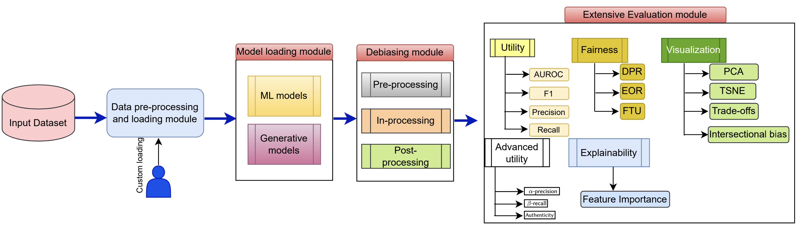
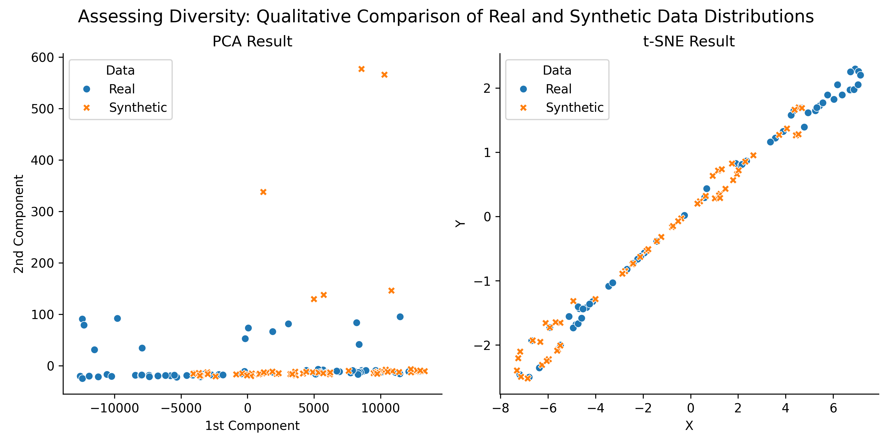
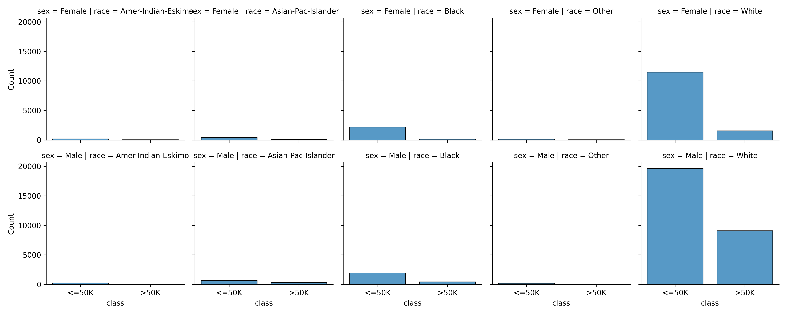
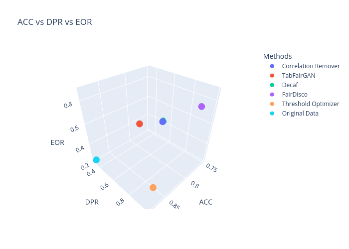
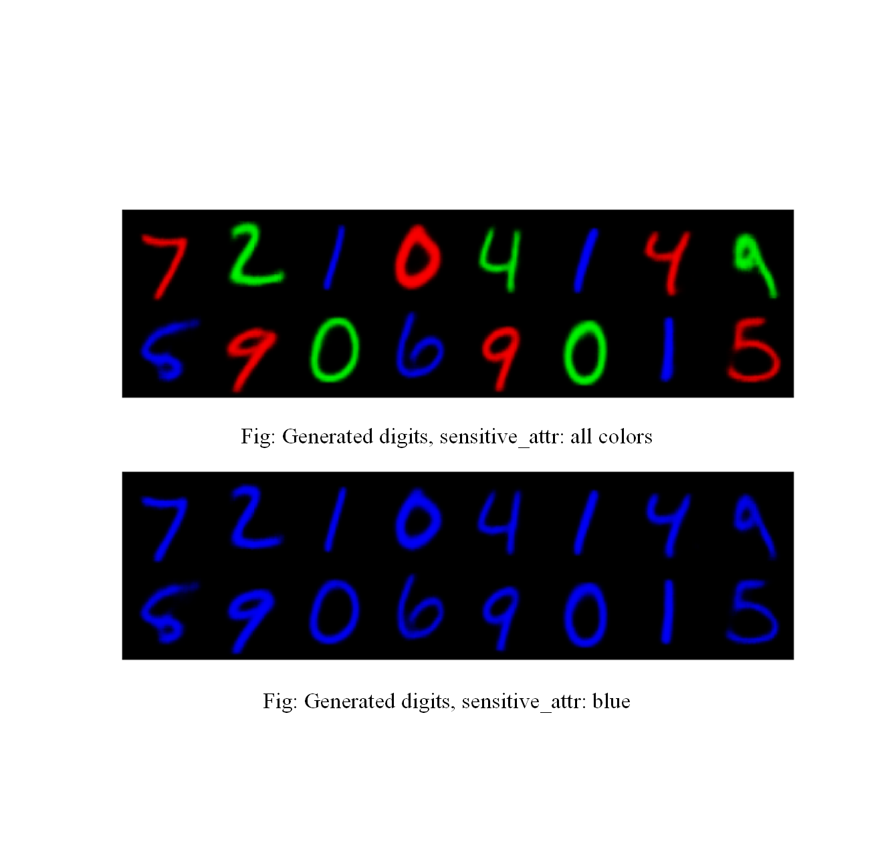
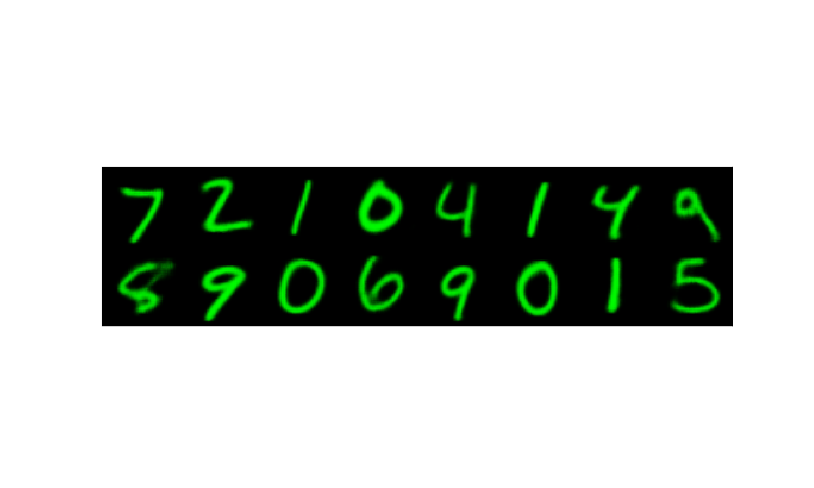
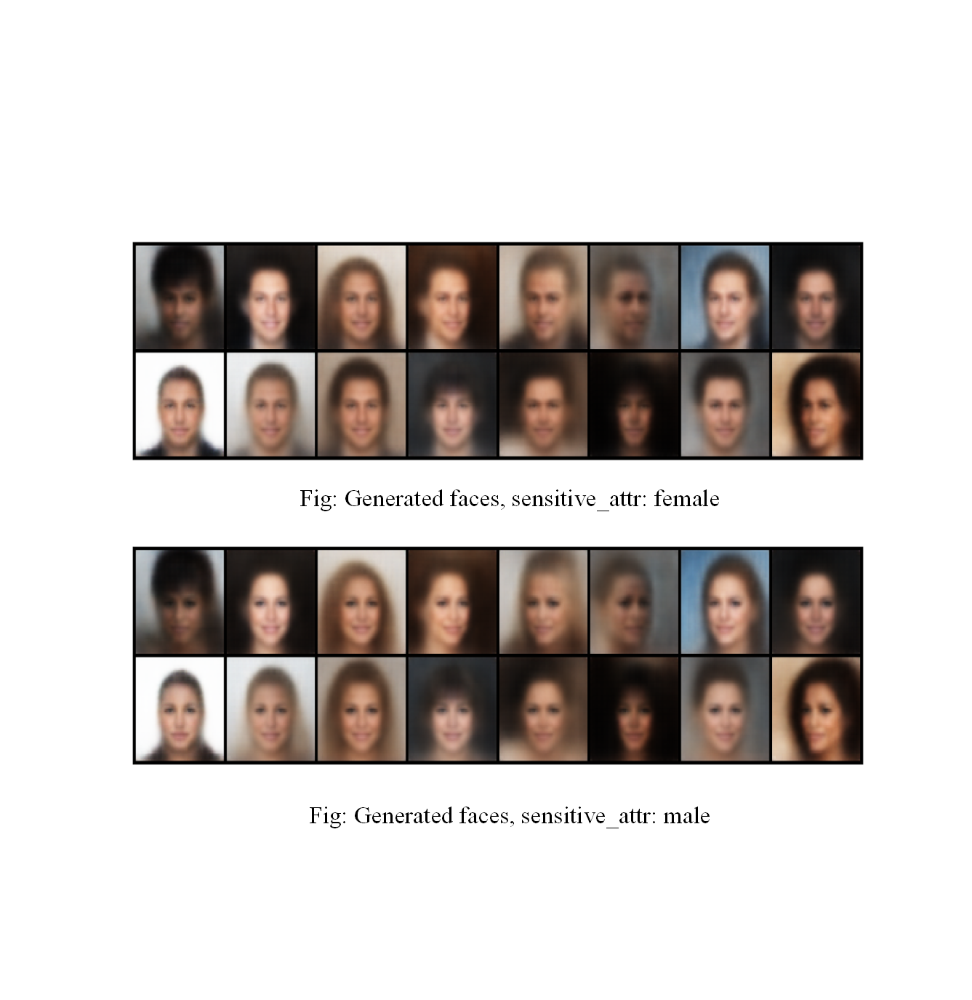

# FairX: A comprehensive benchmarking tool for model analysis using fairness, utility, and explainability

<h1 align="center">
    Fairness Benchmarking toolkit! 
</h1>

<h3 align="center">
    Accepted at AEQUITAS 2024: Workshop on Fairness and Bias in AI | co-located with ECAI 2024, Santiago de Compostela, Spain
</h3>


<div align="center">

[](https://www.python.org/)


</div>


This includes data loader, custom dataset support, different fairness models, and wide range of evaluations. 





## Installation

```terminal
conda create -n fairx python=3.8
conda activate fairx

git clone git@github.com/fahim-sikder/fairx.git

cd fairx

pip install .
```


## Fair Models
### Pre-processing

- [x] Correlation Remover

### In-processing

- [x] TabFairGAN
- [x] Decaf
- [x] FairDisco
- [ ] FLDGMs
### Post-processing

- [x] Threshold Optimizers

## Evaluation Metrics

### Fairness Evaluation

- [x] Demographic Parity Ratio (DPR)
- [x] Equilized Odds Ratio (EOR)
- [x] Fairness Through Unawareness (FTU)
- [ ] Intersectional Bias (IB)

### Data Utility

- [x] Accuracy
- [x] AUROC
- [x] F1-score
- [x] Precision
- [x] Recall

### Synthetic Data Evaluation

- [x] $\alpha-$ precision
- [x] $\beta-$ recall
- [x] Authenticity

## Available Dataset

| **Dataset Name**    | **Protected Attribute**      | **Target Attribute** | **Dataset Type** |
|---------------------|------------------------------|----------------------|------------------|
| Adult-Income        | sex<br>race                  | class                | Tabular          |
| Compass             | sex<br>race_African-American | two_year_recid       | Tabular          |
| Student-performance | sex                          | Pstatus              | Tabular          |
| Predict-diagnosis   | Sex<br>Race                  | Diagnosis            | Tabular          |
| ColorMNIST          | color                        | class                | Image            |
| CelebA              | Eyeglasses                   | Gender               | Image            |

## Usage

**Beside the following example, please check the `tutorials` folder in the repo!**

### Dataset loading

```python
from fairx.dataset import BaseDataClass

dataset_name = 'Adult-Income'
sensitive_attr = 'sex'
attach_target = True

data_class = BaseDataClass(dataset_name, sensitive_attr, attach_target = attach_target)

print(data_class.data.head())
```

### Custom Dataset Loading

```python
from fairx.dataset import CustomDataClass

dataset_path = 'Random-dataset.csv'
sensitive_attr = 'some-sensitive-attribute'
target_attr = 'some-target-feature'
attach_target = True

custom_data_class = CustomDataClass(dataset_path, sensitive_attr, target_attr, attach_target)

print(custom_data_class.data.head())
```

### Model Loading

```python
from fairx.dataset import BaseDataClass

from fairx.models.inprocessing import TabFairGAN

dataset_name = 'Adult-Income'
sensitive_attr = 'sex'
attach_target = True

data_class = BaseDataClass(dataset_name, sensitive_attr, attach_target = attach_target)

under_prev = 'Female'
y_desire = '>50K'

tabfairgan = TabFairGAN(under_prev, y_desire)

tabfairgan.fit(data_class, batch_size = 256, epochs = 5)
```

### Evaluation Utility

```python
from fairx.dataset import BaseDataClass
from fairx.metrics import FairnessUtils, DataUtilsMetrics

dataset_name = 'Adult-Income'
sensitive_attr = 'sex'
attach_target = False

data_class = BaseDataClass(dataset_name, sensitive_attr, attach_target = attach_target)

_, _, tf_data = data_module.preprocess_data()

splitted_data = data_module.split_data(tf_data)

## Data Utility
data_utils = DataUtilsMetrics(splitted_data)
utils_res = data_utils.evaluate_utility()
print(utils_res)

## Fairness
fairness_eval = FairnessUtils(splitted_data)
fairness_res = fairness_eval.evaluate_fairness()
print(fairness_res)
```

## Results

PCA and t-SNE plots of fair synthetic data, generated by TabFairGAN.



Intersectional Bias on `Adult-Income` dataset.



### Model's performance on Data utiliy vs Fairness

Here, we have compared all the model in our benchmarking tools on Data utility vs Fairness metrics. For the data utlity, we calculate the Accuracy and for the fairness, we measure Demographic Parity Ration (DPR) and Equilized Odds Ratio (EOR), and plot them in 3d.



### Image Results

#### Color MNIST

FairDisco on Color MNIST:

Here color is the `Senstitive attribute`!



<!-- 

 -->

#### CelebA

FairDisco on CelebA dataset:



## Tabular Results

**Dataset: `Predict-diagnosis`, Sensitive_attr: `Sex`**


| Methods             |   Precision |   Recall |   Accuracy |   F1 Score |    Auroc |   Demographic Parity Ratio |   Equalized Odd Ratio |   Alpha-precision |   Beta-recall |   Authenticity |
|:--------------------|------------:|---------:|-----------:|-----------:|---------:|---------------------------:|----------------------:|------------------:|--------------:|---------------:|
| Correlation Remover |    0.93783  | 0.947836 |   0.941212 |   0.942807 | 0.94106  |                   0.700837 |              0.59161  |        n/a        |    n/a        |     n/a        |
| Threshold Optimizer |    0.940211 | 0.9508   |   0.943939 |   0.945476 | 0.943782 |                   0.938307 |              0.183804 |        n/a        |    n/a        |     n/a        |
| FairDisco           |    0.561947 | 0.538592 |   0.527727 |   0.550022 | 0.526887 |                   0.956767 |              0.824377 |        n/a        |    n/a        |     n/a        |
| TabFairGAN          |    0.965393 | 0.964621 |   0.964172 |   0.965007 | 0.964161 |                   0.665885 |              0.713686 |          0.85877  |      0.354679 |       0.586545 |
| Decaf               |    0.981911 | 0.979143 |   0.977    |   0.980525 | 0.976521 |                   0.552198 |              0.281135 |          0.704436 |      0.32964  |       0.5996   |


More results coming soon!

## Citation

If you use our benchmark, please cite our work.

```bibtex
@article{sikder2024fairx,
  title={FairX: A comprehensive benchmarking tool for model analysis using fairness, utility, and explainability},
  author={Sikder, Md Fahim and Ramachandranpillai, Resmi and de Leng, Daniel and Heintz, Fredrik},
  journal={arXiv preprint arXiv:2406.14281},
  year={2024}
}
```


## References

1. https://github.com/fairlearn/fairlearn
2. https://github.com/Trusted-AI/AIF360
3. https://github.com/shap/shap
